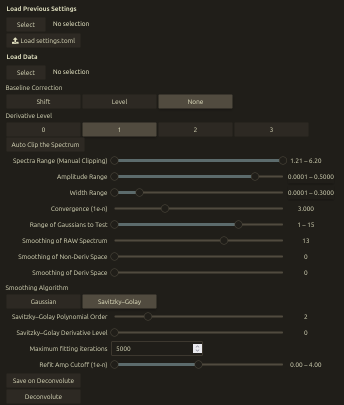
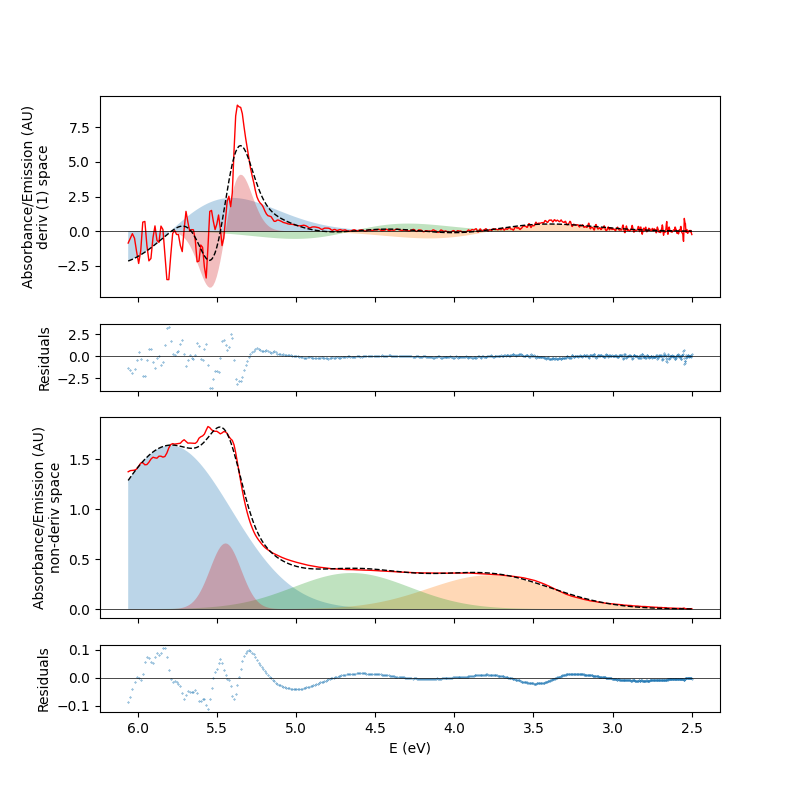

# Deconvolution toolkit V2

This is a jupyter notebook heavily based on that written by Andrea Snow providing a workflow for UV-vis deconvolution and Fluorescence spectra into component Gaussians, either in derivative or non-derivative space.

## Requirements

* python >= 3.10 (it uses native dataclasses)
* numpy
* scipy
* matplotlib
* jupyter lab
* ipywidgets
* ipyfilechooser
* tqdm
* ipympl

These can all be installed via conda or pip

```bash
conda install python numpy scipy matplotlib ipywidgets ipyfilechooser tqdm jupyterlab ipympl
```

or 

```bash
pip install python numpy scipy matplotlib ipywidgets ipyfilechooser tqdm jupyterlab ipympl
```

## Running

Once you have the dependencies, you should be able to clone it down and run it as you would any jupyter notebook.

```bash
git clone https://github.com/JamesRobin-Weir/uv-vis-deconvolution.git Downloads/deconvolution
jupyter lab --notebook-dir=Downloads/deconvolution
```




